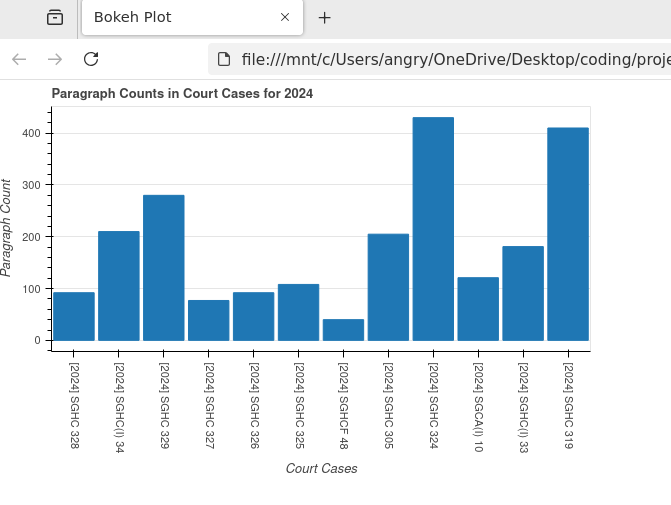
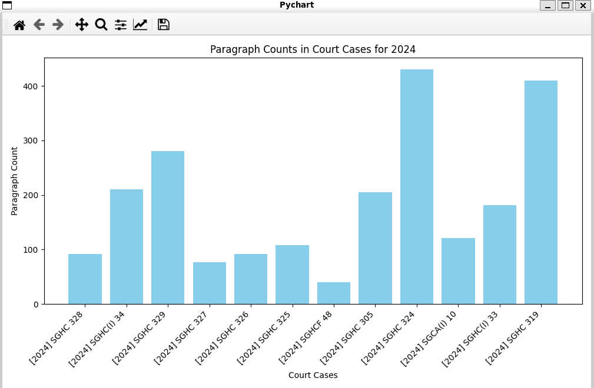
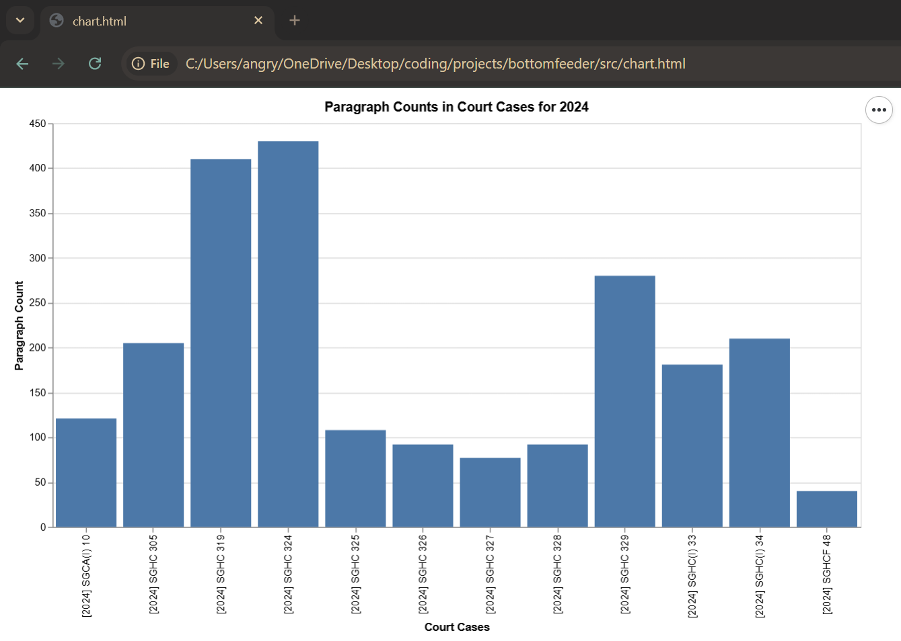

[](https://github.com/gongahkia/bottomfeeder/releases/tag/1.0)

# `Bottomfeeder` 💼

Judges' stats, scraped from [www.elitigation.sg](https://www.elitigation.sg/_layouts/IELS/HomePage/Pages/Home.aspx). 

## Rationale

Put this together in [6 hours and 41 minutes](https://github.com/gongahkia/bottomfeeder/commit/d056533d8794f0a3d3cd2a248bd86a3ec727405f) for [fun](https://dictionary.cambridge.org/dictionary/english/fun).

I am the king of procrastination.

<div align="center">
    </img>
</div>

## [Scraper](./src/scraper.py)

Scraper outputs are written to [`./src/generated_log/`](./src/generated_log/).

## [Transpilation](./src/transpiler.py) outputs

<table>
<thead>
<tr>
<th>Target</th>
<th>Purpose</th>
<th>Status</th>
<th>Usage</th>
</tr>
</thead>
<tbody>
<tr>
<td>$\LaTeX$</td>
<td>
Formatted typesetting for academic purposes
</td>
<td>


</td>
<td>

```py
filepath = "./generated_log/log.json"
t.generate_latex(filepath)
```

</td>
</tr>
<tr>
<td>CSV</td>
<td>
Ubiquitous  format for storing tabular data
</td>
<td>


</td>
<td>

```py
filepath = "./generated_log/log.json"
t.generate_csv(filepath)
```

</td>
</tr>
<tr>
<td>XML</td>
<td>
Streamlined markup language for data transportation and storage
</td>
<td>


</td>
<td>

```py
filepath = "./generated_log/log.json"
t.generate_xml(filepath)
```

</td>
</tr>
<tr>
<td>HDF5</td>
<td>
Optimised for mass storage of scientific data
</td>
<td>


</td>
<td>

```py
filepath = "./generated_log/log.json"
t.generate_hdf5(filepath)
```

</td>
</tr>
<tr>
<td>Pickle</td>
<td>
Python-specific binary serialization format 
</td>
<td>


</td>
<td>

```py
filepath = "./generated_log/log.json"
t.generate_pickle(filepath)
```

</td>
</tr>
<tr>
<td>SQL</td>
<td>
Standardised programming language for managing relational databases
<td>


</td>
<td>

```py
filepath = "./generated_log/log.json"
t.generate_sql(filepath)
```

</td>
</tr>
<tr>
<td>D3.js</td>
<td>
JavaScript library for visualising data in the web 
</td>
<td>


</td>
<td>

```py
filepath = "./generated_log/log.json"
t.generate_d3(filepath)
```

</td>
</tr>
</tbody>
</table>

## [Visualisation](./src/render.py) 

<table>
<thead>
<tr>
<th>Target</th>
<th>Purpose</th>
<th>Status</th>
<th>Usage</th>
</tr>
</thead>
<tbody>
<tr>
<td>Bokeh</td>
<td>
Python library for interactive, web-ready visualizations 
</td>
<td>


</td>
<td>

```py
filepath = "./generated_log/log.json"
r.bokeh_visualise(filepath)
```

</td>
</tr>
<tr>
<td>Pychart</td>
<td>
Python module for 2D and 3D charts in the desktop
</td>
<td>


</td>
<td>

```py
filepath = "./generated_log/log.json"
r.pychart_visualise(filepath)
```

</td>
</tr>
<tr>
<td>Altair</td>
<td>
Python library for declarative statistical visualization 
</td>
<td>


</td>
<td>

```py
filepath = "./generated_log/log.json"
r.altair_visualise(filepath)
```

</td>
</tr>
</tbody>
</table>

## Screenshots





## Usage

```console
$ git clone https://github.com/gongahkia/bottomfeeder
$ make config
$ make
```

## Reference

The name `Bottomfeeder` is in reference to [Richard A. Bottomfeeder](https://spongebob.fandom.com/wiki/Richard_A._Bottomfeeder), a prison warden at [Bikini Bottom Jail](https://spongebob.fandom.com/wiki/Bikini_Bottom_Jail).
He first appears in the episode [Krabs vs. Plankton](https://spongebob.fandom.com/wiki/Krabs_vs._Plankton), where he acts as [Mr. Krabs'](https://spongebob.fandom.com/wiki/Eugene_H._Krabs) attorney.


